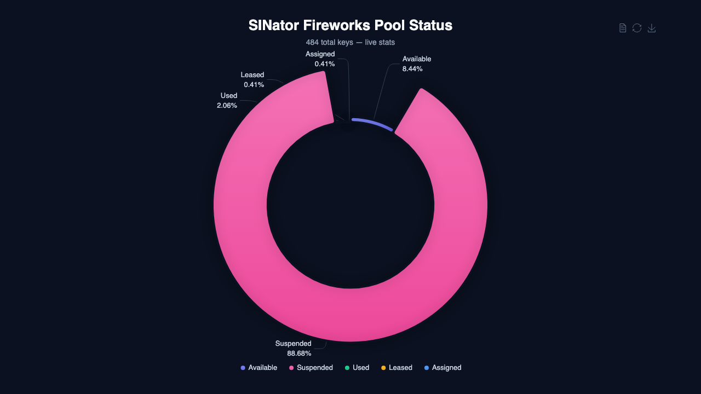
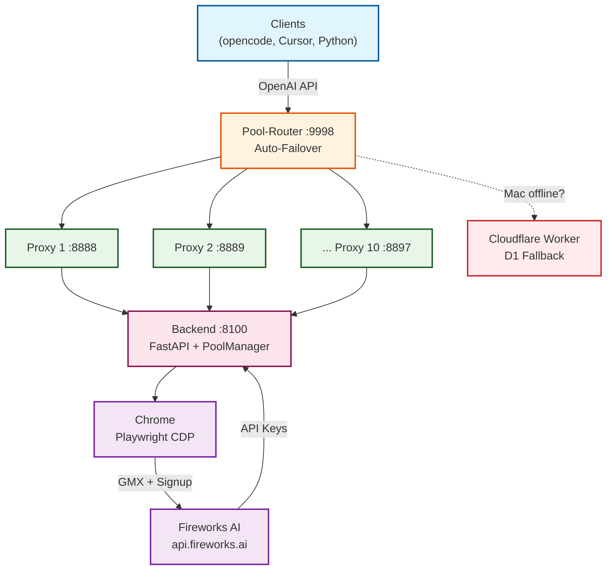

<a name="readme-top"></a>

<!-- BADGES -->
<p align="center">
  <a href="https://github.com/SIN-Rotator/SINator-FireworksAI/blob/main/LICENSE">
    
  </a>
  <a href="https://www.python.org/downloads/">
    
  </a>
  <a href="https://fastapi.tiangolo.com/">
    
  </a>
  <a href="https://playwright.dev/">
    
  </a>
  <a href="https://github.com/SIN-Rotator/SINator-FireworksAI/stargazers">
    
  </a>
  <a href="https://github.com/SIN-Rotator/SINator-FireworksAI/commits/main">
    
  </a>
</p>

<!-- NAVIGATION -->
<p align="center">
  <a href="#what-is-sinator">What is SINator?</a> ·
  <a href="#quick-start">Quick Start</a> ·
  <a href="#features">Features</a> ·
  <a href="#models">Models</a> ·
  <a href="#architecture">Architecture</a> ·
  <a href="#use-cases">Use Cases</a> ·
  <a href="#api-reference">API</a> ·
  <a href="#deploy">Deploy</a> ·
  <a href="#contributing">Contributing</a>
</p>

---

# SINator — Fireworks AI Key Pool

<p align="center">
  <em>Never hit a rate limit again. 484 keys, 10 proxies, 12 models, one URL.</em>
</p>

## What is SINator?

> [!NOTE]
> SINator is an **automated API key pool** for Fireworks AI. It generates accounts via GMX email aliases, rotates keys on rate limits, and exposes a single OpenAI-compatible endpoint with 10-proxy auto-failover.

**The problem:** Fireworks AI enforces per-key rate limits and spending caps. Running multiple AI agents means you hit 429s constantly.

**The solution:** SINator maintains a pool of hundreds of API keys, automatically rotates them on 429/401/403, and gives you **one URL** that never goes down — even if the Mac goes offline (Cloudflare Worker fallback).

### Live Pool Stats

| Metric | Value |
|--------|-------|
| **Total Keys** | 484 |
| **Available** | 41 |
| **Suspended** | 431 |
| **Used** | 10 |
| **Leased** | 2 |
| **Assigned** | 2 |
| **Proxies** | 10 (:8888-:8897) |
| **Router** | :9998 with auto-failover |
| **Backend** | :8100 (FastAPI) |
| **Key Generation** | ~180s per key (fully automated) |

<p align="center">
  
</p>

---

## Quick Start

<table>
  <tr>
    <td width="33%" align="center">
      <strong>1. Clone</strong><br /><br />
      <code>git clone https://github.com/SIN-Rotator/SINator-FireworksAI.git</code><br /><br />
      
    </td>
    <td width="33%" align="center">
      <strong>2. Install</strong><br /><br />
      <code>pip install -r agent_toolbox/requirements.txt</code><br /><br />
      
    </td>
    <td width="33%" align="center">
      <strong>3. Run</strong><br /><br />
      <code>python agent_toolbox/start_toolbox.py</code><br /><br />
      
    </td>
  </tr>
</table>

> [!TIP]
> For the full dashboard experience (Tauri app + visual pool stats), use the [SINator-dashboard](https://github.com/SIN-Rotator/SINator-dashboard) companion repo.

<details>
<summary>Standalone (without dashboard)</summary>

```bash
git clone https://github.com/SIN-Rotator/SINator-FireworksAI.git
cd SINator-FireworksAI
pip install -r agent_toolbox/requirements.txt

# Configure GMX credentials
cp config.example.json data/config.json
# Edit data/config.json with your GMX + Fireworks passwords

# Start backend
python agent_toolbox/start_toolbox.py
# → http://localhost:8100/docs (Swagger UI)

# Start pool router (separate terminal)
python3 scripts/pool-router.py
# → http://localhost:9998/inference/v1
```

</details>

---

## Features

| Capability | Description | Status |
|:-----------|:------------|:------:|
| **Automated Key Generation** | GMX alias rotation → Fireworks signup → OTP verification → API key extraction | ✅ |
| **10-Proxy Auto-Failover** | Router distributes across 10 proxies, automatic switch on errors | ✅ |
| **Silent Key Swap** | On 429/401/403, proxy swaps key without client noticing | ✅ |
| **Soft-Ownership** | Agents get dedicated keys (V19.14) with heartbeat | ✅ |
| **Cloudflare Fallback** | When Mac goes offline, CF Worker takes over with D1 key rotation | ✅ |
| **OpenAI-Compatible** | One URL works with opencode, Cursor, Continue, Python SDK, curl | ✅ |
| **12 Fireworks Models** | DeepSeek V4, GLM 5.1/5.2, Kimi K2.6/K2.7, Qwen 3.6/3.7, MiniMax M2.7/M3, GPT-OSS | ✅ |
| **Pool Dashboard** | Visual stats, key management, rotation trigger | ✅ |
| **Frame-aware OTP** | Smart OTP extraction from GMX inbox with shadow DOM support | ✅ |
| **1s Key-Retry** | No immediate 503 — 300 retries over 5 minutes before giving up | ✅ |

<details>
<summary>Full Key Status Reference</summary>

| Status | Meaning |
|--------|---------|
| `available` | Usable, not assigned |
| `assigned` | Soft-ownership — dedicated to one agent |
| `shared` | Used by multiple agents simultaneously |
| `leased` | Reserved by proxy (primary + backup) |
| `used` | Manually consumed |
| `suspended` | Blocked by Fireworks (401/403) |

`available = total - used - suspended - assigned`

</details>

---

## Models

12 Fireworks AI models accessible through one endpoint:

| Model | ID | Context | Output | Vision |
|:------|:---|--------:|-------:|:------:|
| **DeepSeek V4 Pro** | `accounts/fireworks/models/deepseek-v4-pro` | 1M | 64K | ✅ |
| **DeepSeek V4 Flash** | `accounts/fireworks/models/deepseek-v4-flash` | 1M | 64K | ✅ |
| **GLM 5.1** | `accounts/fireworks/models/glm-5p1` | 198K | 32K | ✅ |
| **GLM 5.1 Fast** | `accounts/fireworks/routers/glm-5p1-fast` | 128K | 16K | ✅ |
| **GLM 5.2** | `accounts/fireworks/models/glm-5p2` | 256K | 64K | ✅ |
| **Kimi K2.6** | `accounts/fireworks/models/kimi-k2p6` | 256K | 32K | ✅ |
| **Kimi K2.6 Turbo** | `accounts/fireworks/routers/kimi-k2p6-turbo` | 128K | 16K | ✅ |
| **Kimi K2.7 Code** | `accounts/fireworks/models/kimi-k2p7-code` | 256K | 32K | ✅ |
| **Kimi K2.7 Code Fast** | `accounts/fireworks/routers/kimi-k2p7-code-fast` | 128K | 16K | ✅ |
| **MiniMax M2.7** | `accounts/fireworks/models/minimax-m2p7` | 192K | 32K | ✅ |
| **MiniMax M3** | `accounts/fireworks/models/minimax-m3` | 512K | 64K | ✅ |
| **Qwen 3.7 Plus** | `accounts/fireworks/models/qwen3p7-plus` | 256K | 32K | ✅ |

<p align="center">
  
</p>

<details>
<summary>Usage Examples</summary>

### OpenCode

```bash
mkdir -p ~/.config/opencode
curl -fsSL https://raw.githubusercontent.com/OpenSIN-Code/SIN-Code-FireworksAI-OpenCode-Config/main/opencode.json \
  -o ~/.config/opencode/opencode.json
```

### Python / curl

```python
from openai import OpenAI
client = OpenAI(
    base_url="https://sinatorpool-router.delqhi.com/inference/v1",
    api_key="<YOUR_API_KEY>",
)

response = client.chat.completions.create(
    model="accounts/fireworks/models/deepseek-v4-pro",
    messages=[{"role": "user", "content": "Hello!"}],
)
```

```bash
curl https://sinatorpool-router.delqhi.com/inference/v1/chat/completions \
  -H "Authorization: Bearer <YOUR_API_KEY>" \
  -d '{"model":"accounts/fireworks/models/minimax-m3","messages":[{"role":"user","content":"Hi"}]}'
```

### Hermes

```bash
curl -fsSL https://raw.githubusercontent.com/SIN-Hermes-Bundles/SIN-Hermes-Provider-Bundle/main/config/fireworks-router.yaml \
  -o ~/.hermes/config.yaml
hermes auth add custom:fireworks --type api-key --api-key "$FIREWORKS_AI_API_KEY"
```

</details>

---

## Architecture



<details>
<summary>Detailed Architecture + Key Rotation Logic</summary>

```
Clients (opencode, Cursor, Continue, Python)
  ↓ OpenAI-compatible API (ONE URL)
Pool-Router (:9998, ThreadingMixIn)
  ↓ Auto-Failover across 10 Proxies
Pool Proxys (:8888-:8897, aiohttp SSE, silent key swap)
  ↓ Key rotation on 412/429/401, 1s Key-Retry
Backend (:8100, FastAPI)
  ↓ PoolManager + Keychain + Rotation-Orchestrator
Chrome (Playwright CDP V15.4, single browser)
  ↓ GMX + Fireworks Automation
Alias-Rotation → Signup → OTP → API Key → Pool
```

**Key rotation logic:**
1. New requests → next available key from pool. On 429 → cooldown + retry with new key
2. Existing chats → always the creation key (state-mapping). Key swap = 401
3. 429 on stateful → passed through (key swap would cause 401)
4. 401/403 → key marked "suspended"
5. Cooldown → 60s default, then key available again
6. No key available → 503

</details>

---

## Use Cases

| Who | Problem | Solution |
|:----|:--------|:---------|
| **AI Agent Developers** | Hit rate limits running multiple agents | Pool of 484 keys, auto-rotation on 429 |
| **Teams** | Need one endpoint for all tools | Single URL with 10-proxy failover |
| **Homelab Users** | Mac goes offline, agents stop | Cloudflare Worker fallback with D1 rotation |
| **API Consumers** | Different tools need Fireworks access | OpenAI-compatible — works with any client |
| **Cost Optimizers** | Free tier keys hit spending caps | Automatic swap to next key on spending limit |

---

## API Reference

### Pool Endpoints

| Endpoint | Method | Description |
|:---------|:-------|:------------|
| `/api/v1/pool/stats` | GET | `total/used/suspended/assigned/shared/available` |
| `/api/v1/pool/keys` | GET | All keys with status |
| `/api/v1/pool/lease` | POST | Reserve a key (legacy) |
| `/api/v1/pool/return` | POST | Release a key |
| `/api/v1/pool/report` | POST | Report bad key + auto-lease replacement |
| `/api/v1/pool/add` | POST | Add a key manually |
| `/api/v1/pool/agent-key` | POST | V19.14 — Soft-ownership key assignment |
| `/api/v1/pool/agent-release` | POST | V19.14 — Agent releases key |
| `/api/v1/pool/agent-heartbeat` | POST | V19.14 — Agent heartbeat |

---

## Deploy

| Method | Command | Purpose |
|:-------|:--------|:--------|
| **Backend** | `python agent_toolbox/start_toolbox.py` | FastAPI on :8100 |
| **Pool Router** | `python3 scripts/pool-router.py` | Load balancer on :9998 |
| **Cloudflare** | `cd cloudflare && wrangler deploy` | Fallback worker with D1 |

<details>
<summary>Cloudflare Fallback Setup</summary>

The Mac stays primary. When it goes offline (CF DNS Health Check fails), a Cloudflare Worker with D1 database takes over — key rotation runs in the worker.

| Aspect | Solution |
|--------|---------|
| Smart Router | CF DNS checks Mac → Mac dead = Worker takes over |
| Proxies | 1 Worker instead of 10 (key rotation in D1) |
| Storage | D1 Database instead of `pool.json` |
| Sync | Mac → CF after each rotation (`scripts/sync_to_cf.py`) |
| Free Tier | 100k req/day (~10 users) |

```bash
# Start router with fallback
export CF_WORKER_URL="https://sinator-fallback.<account>.workers.dev"
export SINATOR_AUTH_TOKEN="<client-bearer>"
python3 scripts/pool-router.py

# Sync pool to D1 after rotation
CF_WORKER_URL=... CF_SYNC_TOKEN=... python3 scripts/sync_to_cf.py
```

See [`cloudflare/README.md`](cloudflare/README.md) for deploy steps, D1 schema, and details.

</details>

<details>
<summary>Configuration</summary>

**GMX credentials** via `/setup` in dashboard, or directly `data/config.json`:

```json
{
  "gmx_email": "yourname@gmx.de",
  "gmx_password": "YOUR_GMX_PASSWORD",
  "fireworks_password": "YOUR_FIREWORKS_PASSWORD"
}
```

**Rotation** via dashboard `/rotation` or `python tools/rotate.py`

</details>

---

## Repository Ecosystem

| Repo | GitHub | Function |
|:-----|:-------|:---------|
| **SINator-FireworksAI** (this) | [SIN-Rotator/SINator-FireworksAI](https://github.com/SIN-Rotator/SINator-FireworksAI) | Key pool + proxy + automation |
| **SINator-dashboard** | [SIN-Rotator/SINator-dashboard](https://github.com/SIN-Rotator/SINator-dashboard) | Tauri dashboard + setup wizard |
| **SINator-heypiggy** | [SIN-Rotator/SINator-heypiggy](https://github.com/SIN-Rotator/SINator-heypiggy) | HeyPiggy account generator |
| **OpenCode Config** | [OpenSIN-Code/SIN-Code-FireworksAI-OpenCode-Config](https://github.com/OpenSIN-Code/SIN-Code-FireworksAI-OpenCode-Config) | opencode.json with 12 models |
| **Hermes Bundle** | [SIN-Hermes-Bundles/SIN-Hermes-Provider-Bundle](https://github.com/SIN-Hermes-Bundles/SIN-Hermes-Provider-Bundle) | Hermes provider config |

```
SINator-FireworksAI/
├── agent_toolbox/          # FastAPI backend + PoolManager
│   ├── core/               # Keychain, rotation, pool logic
│   └── api/                # REST endpoints
├── scripts/
│   ├── pool-router.py      # Load balancer (:9998)
│   └── sync_to_cf.py       # Cloudflare D1 sync
├── cloudflare/
│   ├── worker.js           # CF Worker fallback
│   ├── schema.sql          # D1 database schema
│   └── wrangler.toml       # CF deploy config
├── fireworks/              # Fireworks AI automation
│   ├── signup.py           # Account registration
│   ├── login.py            # Login flow
│   └── create_apikey.py    # API key extraction
├── gmx/                    # GMX email automation
│   ├── create_alias.py     # Email alias rotation
│   ├── read_otp.py         # OTP extraction
│   └── rotate_alias.py     # Alias lifecycle
├── config/                 # Pool proxy configs
│   ├── fireworks-pool1.yaml
│   └── fireworks-router.yaml
├── assets/                 # Charts and images
│   ├── pool-status.png     # Live pool distribution chart
│   └── model-context.png   # Model context comparison chart
└── docs/                   # Architecture + troubleshooting
```

---

## Contributing

1. **Fork** the repository
2. Create your branch (`git checkout -b feature/amazing-feature`)
3. Test your changes (`python -m pytest tests/ -v`)
4. Commit (`git commit -m 'Add amazing feature'`)
5. Push (`git push origin feature/amazing-feature`)
6. Open a **Pull Request**

> [!NOTE]
> This project uses the [SINator-fireworks skill](https://github.com/OpenSIN-Code/Infra-SIN-OpenCode-Stack/tree/main/skills/SINator-fireworks) for onboarding automation. See the skill docs for rotation troubleshooting.

---

## License

Distributed under the **MIT License**. See [LICENSE](LICENSE) for more information.

---

<p align="center">
  <a href="https://opensin.ai">
    
  </a>
</p>

<p align="center">
  <sub>Entwickelt vom <a href="https://opensin.ai"><strong>OpenSIN-AI</strong></a> Ökosystem – Enterprise AI Agents die autonom arbeiten.</sub><br/>
  <sub>🌐 <a href="https://opensin.ai">opensin.ai</a> · 💬 <a href="https://opensin.ai/agents">Alle Agenten</a> · 🚀 <a href="https://opensin.ai/dashboard">Dashboard</a></sub>
</p>

<p align="right">(<a href="#readme-top">back to top</a>)</p>
