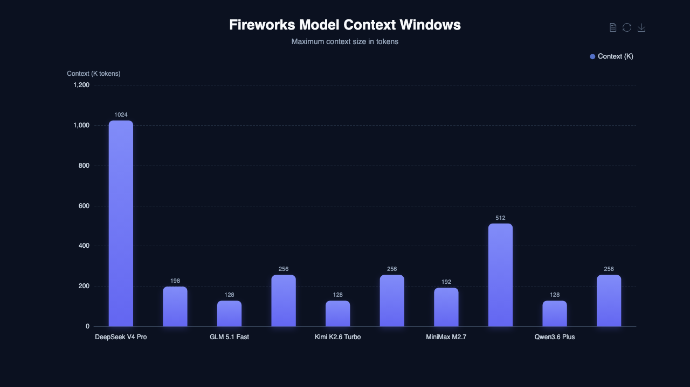

<a name="readme-top"></a>

# SINator &mdash; Fireworks AI Key Pool

<p align="center">
  <em>Never hit a rate limit again. 1000+ keys, 10 proxies, VM auto-rotator, one URL.</em>
</p>

<p align="center">
  <a href="./LICENSE">
    
  </a>
  <a href="https://www.python.org/downloads/">
    
  </a>
  <a href="https://fastapi.tiangolo.com/">
    
  </a>
  <a href="https://github.com/SIN-Rotator/SINator-FireworksAI/stargazers">
    
  </a>
</p>

<p align="center">
  <a href="#quick-start">Quick Start</a> |
  <a href="#features">Features</a> |
  <a href="#models">Models</a> |
  <a href="#api">API</a> |
  <a href="#contributing">Contributing</a>
</p>

<picture>
  <source media="(prefers-color-scheme: dark)" srcset="./assets/hero-banner.svg" />
  <source media="(prefers-color-scheme: light)" srcset="./assets/hero-banner-light.svg" />
  
</picture>

---

An automated API key pool for Fireworks AI. It generates accounts via GMX email aliases on an OCI VM with Playwright, rotates keys on rate limits, and exposes a single OpenAI-compatible endpoint with 10-proxy auto-failover.

**The problem:** Fireworks AI enforces per-key rate limits and spending caps. Running multiple AI agents means you hit 429s constantly.

**The solution:** SINator maintains a pool of 1000+ API keys, automatically rotates them on 429/401/403/412, and gives you one URL that never goes down. An OCI VM auto-generates new keys every 10 minutes when the pool runs low.

## Quick Start

```bash
git clone https://github.com/SIN-Rotator/SINator-FireworksAI.git
cd SINator-FireworksAI
pip install -r agent_toolbox/requirements.txt
python agent_toolbox/start_toolbox.py
```

```python
from openai import OpenAI

client = OpenAI(
    base_url="http://localhost:9998/inference/v1",
    api_key="your-pool-token",
)

response = client.chat.completions.create(
    model="accounts/fireworks/models/deepseek-v4-pro",
    messages=[{"role": "user", "content": "Hello!"}],
)
```

> [!NOTE]
> For full setup (GMX credentials, proxy config, Cloudflare fallback), see [docs/setup.md](docs/setup.md).

## Features

- **Automated Key Generation** &mdash; GMX alias rotation, Fireworks signup, OTP verification, API key extraction, all fully automated via Playwright CDP on OCI VM
- **VM Auto-Rotator** &mdash; systemd timer fires every 10min, checks pool stats, generates 10 keys if available < 5
- **10-Proxy Auto-Failover** &mdash; Router distributes across 10 proxies with automatic switch on errors
- **Fail-Closed Proxy** &mdash; `_verify_key_dead()` returns True on any exception (dead), 412 "suspended" triggers immediate swap
- **Silent Key Swap** &mdash; On 429/401/403/412, proxy swaps key without the client ever noticing
- **Crash Resilience** &mdash; Lock-file cleanup on boot, GMX session backup (hourly cron), login cooldown (60s), session-restore fallback
- **Responsive Polling** &mdash; All fixed sleeps replaced with 0.2-0.3s polling — 45% faster per key (~80s vs 137s)
- **Cloudflare Fallback** &mdash; When the Mac goes offline, a CF Worker with D1 database takes over automatically
- **OpenAI-Compatible** &mdash; One URL works with opencode, Cursor, Continue, Python SDK, curl, any OpenAI client
- **12 Fireworks Models** &mdash; DeepSeek V4, GLM 5.1/5.2, Kimi K2.6/K2.7, Qwen 3.6/3.7, MiniMax M2.7/M3

## Live Pool Stats

The pool currently manages **1000+ keys** across 10 proxies. The OCI VM auto-rotator generates new keys every 10 minutes when available drops below 5. Fireworks suspends GMX-alias accounts within hours (spending limit), so the system is designed for continuous key churn.

| Metric | Value |
|--------|-------|
| **Total Keys** | 1000+ |
| **Available** | Dynamic (auto-replenished) |
| **Suspended** | ~98% (Fireworks spending caps) |
| **Auto-Rotator** | Every 10min if available < 5 |
| **Key Generation Time** | ~80s per key (polling-optimized) |

## Models

12 Fireworks AI models accessible through one endpoint:

| Model | ID | Context | Output |
|:------|:---|--------:|-------:|
| **DeepSeek V4 Pro** | `accounts/fireworks/models/deepseek-v4-pro` | 1M | 64K |
| **DeepSeek V4 Flash** | `accounts/fireworks/models/deepseek-v4-flash` | 1M | 64K |
| **GLM 5.1** | `accounts/fireworks/models/glm-5p1` | 198K | 32K |
| **GLM 5.1 Fast** | `accounts/fireworks/routers/glm-5p1-fast` | 128K | 16K |
| **GLM 5.2** | `accounts/fireworks/models/glm-5p2` | 256K | 64K |
| **Kimi K2.6** | `accounts/fireworks/models/kimi-k2p6` | 256K | 32K |
| **Kimi K2.6 Turbo** | `accounts/fireworks/routers/kimi-k2p6-turbo` | 128K | 16K |
| **Kimi K2.7 Code** | `accounts/fireworks/models/kimi-k2p7-code` | 256K | 32K |
| **Kimi K2.7 Code Fast** | `accounts/fireworks/routers/kimi-k2p7-code-fast` | 128K | 16K |
| **MiniMax M2.7** | `accounts/fireworks/models/minimax-m2p7` | 192K | 32K |
| **MiniMax M3** | `accounts/fireworks/models/minimax-m3` | 512K | 64K |
| **Qwen 3.7 Plus** | `accounts/fireworks/models/qwen3p7-plus` | 256K | 32K |

Context windows range from 128K to 1M tokens. DeepSeek V4 leads with 1M, while MiniMax M3 offers 512K for long-context tasks:



### Usage

**OpenCode:**

```bash
mkdir -p ~/.config/opencode
curl -fsSL https://raw.githubusercontent.com/OpenSIN-Code/SIN-Code-FireworksAI-OpenCode-Config/main/opencode.json \
  -o ~/.config/opencode/opencode.json
```

**curl:**

```bash
curl http://localhost:9998/inference/v1/chat/completions \
  -H "Authorization: Bearer your-pool-token" \
  -d '{"model":"accounts/fireworks/models/minimax-m3","messages":[{"role":"user","content":"Hi"}]}'
```

## Key Rotation Logic

1. **New requests** &mdash; next available key from pool. On 429, cooldown + retry with new key
2. **Existing chats** &mdash; always the creation key (state-mapping). Key swap would cause 401
3. **429 on stateful** &mdash; passed through (key swap would cause 401)
4. **401/403** &mdash; key marked "suspended", removed from rotation
5. **412 + "suspended"** &mdash; immediate swap, no verify needed (account suspended by Fireworks)
6. **Exception in verify** &mdash; key treated as dead (fail-closed), swapped immediately
7. **Cooldown** &mdash; 60s default, then key available again
8. **No key available** &mdash; 503 after retries

## API

### Pool Endpoints

| Endpoint | Method | Description |
|:---------|:-------|:------------|
| `/api/v1/pool/stats` | GET | Pool statistics (total, available, suspended, etc.) |
| `/api/v1/pool/keys` | GET | All keys with status |
| `/api/v1/pool/lease` | POST | Reserve a key |
| `/api/v1/pool/return` | POST | Release a key |
| `/api/v1/pool/report` | POST | Report bad key + auto-lease replacement |
| `/api/v1/pool/add` | POST | Add a key manually |
| `/api/v1/pool/agent-key` | POST | Soft-ownership key assignment |
| `/api/v1/pool/agent-release` | POST | Agent releases key |
| `/api/v1/pool/agent-heartbeat` | POST | Agent heartbeat |

Full API docs at `http://localhost:8100/docs` (Swagger UI).

## Architecture

```
OpenCode CLI / Cursor / OpenAI Clients
  |  OpenAI-compatible API (ONE URL)
  v
Pool-Router (:9998, auto-failover)
  |  distributes across 10 proxies
  v
Pool Proxys (:8888-:8897, silent key swap)
  |  fail-closed verify, 412 immediate swap
  v
Backend (:8100, FastAPI + PoolManager)
  |  PoolManager + Keychain + /pool/health
  v
OCI VM (sin-supabase, 92.5.60.87)
  |  systemd timer every 10min
  |  auto_keygen_vm.py → rotate_vm.py N
  |  Chrome CDP :9222 on Xvfb :99
  |  GMX alias → Fireworks signup → OTP → API key
  |  Push to Mac backend via sinator.delqhi.com
  v
Fireworks AI (api.fireworks.ai)
```

### OCI VM Services

| Service | Purpose |
|:--------|:--------|
| `sinator-xvfb.service` | Virtual display :99 |
| `sinator-chromium.service` | Chrome CDP :9222, `Restart=always`, lock cleanup on boot |
| `sinator-novnc.service` | noVNC web viewer :6080 for manual GMX login |
| `sinator-auto-rotator.timer` | Fires every 10min |
| `sinator-auto-rotator.service` | Checks pool, generates 10 keys if available < 5 |

### Crash Recovery

| Problem | Fix |
|:--------|:---|
| Stale lock file after reboot | `ExecStartPre` in chromium service cleans locks |
| Lock file permission (root vs ubuntu) | `chmod 0666` on lock files |
| GMX account blocked (too many logins) | 60s login cooldown + noVNC manual login |
| GMX session lost (cookies deleted) | Hourly cron backup + `restore_gmx_session.sh` |
| Concurrent rotator runs | `fcntl.flock` prevents, `ExecStartPre` removed from auto-rotator |
| Proxy serving dead keys | Fail-closed `_verify_key_dead()`, 412 immediate swap |

## Deploy

| Method | Command |
|:-------|:--------|
| **Backend** | `python agent_toolbox/start_toolbox.py` |
| **Pool Router** | `python3 scripts/pool-router.py` |
| **Cloudflare** | `cd cloudflare && wrangler deploy` |

> [!NOTE]
> See [cloudflare/README.md](cloudflare/README.md) for Cloudflare Worker fallback setup with D1 database.

## Ecosystem

| Repo | Function |
|:-----|:---------|
| **SINator-FireworksAI** (this) | Key pool + proxy + backend (Mac) |
| [SINator-Fireworks-Rotator-v2](https://github.com/SIN-Rotator/SINator-Fireworks-Rotator-v2) | VM key generation (OCI VM, Playwright) |
| [SINator-dashboard](https://github.com/SIN-Rotator/SINator-dashboard) | Tauri dashboard + setup wizard |
| [SINator-heypiggy](https://github.com/SIN-Rotator/SINator-heypiggy) | HeyPiggy account generator |
| [OpenCode Config](https://github.com/OpenSIN-Code/SIN-Code-FireworksAI-OpenCode-Config) | opencode.json with 12 models |

## Contributing

1. Fork the repository
2. Work on `main` (no branches &mdash; this repo uses direct-to-main)
3. Test your changes (`python -m pytest tests/ -v`)
4. Conventional commits (`fix:`, `feat:`, `perf:`)
5. Push to `main`

See [CONTRIBUTING.md](CONTRIBUTING.md) for details.

## License

Distributed under the **MIT License**. See [LICENSE](LICENSE) for details.

<p align="center">
  <picture>
    <source media="(prefers-color-scheme: dark)" srcset="./assets/sin-ai-banner.svg" />
    <source media="(prefers-color-scheme: light)" srcset="./assets/sin-ai-banner-light.svg" />
    
  </picture>
</p>
